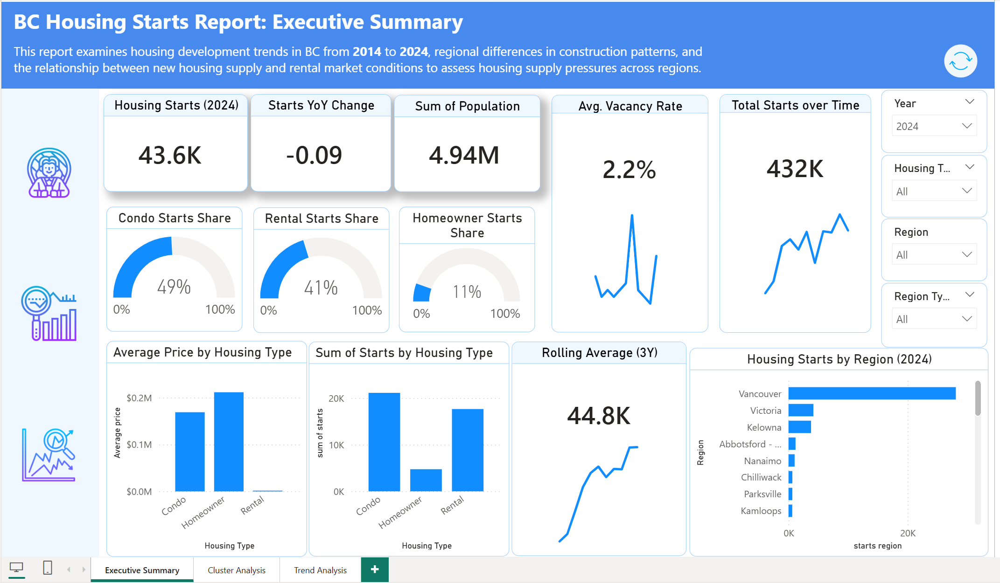
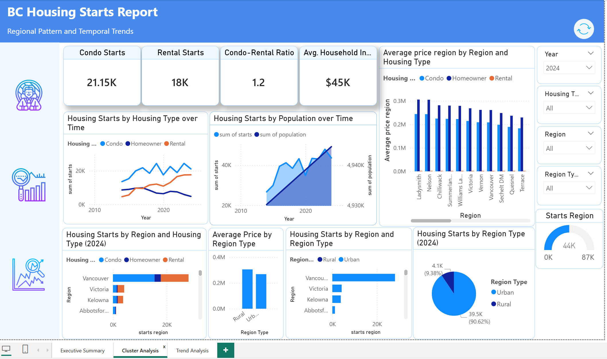

# BC Housing Supply Analysis (2014–2024)

**Interactive Dashboard & Executive Analytical Report**

---

## 📌 Project Overview

This project analyzes housing development dynamics in British Columbia between 2014 and 2024.

The objective is to evaluate:

- How housing starts have evolved over time  
- How development patterns differ across regions  
- How new housing supply aligns with vacancy rates and rental market conditions  

The analysis is delivered through an interactive **BC Housing Dashboard** supported by a structured executive report.

---

## ❓ Key Business Questions

1. How have housing starts evolved over the past decade?  
2. How do housing development patterns differ across regions?  
3. How does new housing supply respond to vacancy rates and rental market pressures?  

---

## 📊 Executive Snapshot (2024)

- **43,600** housing starts across British Columbia  
- **9% year-over-year decline** in total construction  
- **2.2% vacancy rate**, indicating continued market tightness  
- **433,000 cumulative housing starts** (2014–2024)  
- Condo (49%) and rental (41%) dominate new supply  
- Development highly concentrated in major urban centers, particularly Vancouver  

---

## 🔍 Analytical Insights

### 1️⃣ Rental Housing Shows Stronger Market Responsiveness  
Rental construction demonstrated greater resilience compared to condominium and homeowner development, maintaining stability despite overall construction slowdown. It also shows stronger alignment with vacancy conditions, suggesting higher responsiveness to short-term market pressure.

### 2️⃣ Housing Supply Does Not Scale Proportionally with Prices or Income  
Although both housing prices and household income have trended upward, housing starts remain cyclical and uneven. This indicates that supply responsiveness is influenced by structural and operational constraints beyond affordability indicators alone.

### 3️⃣ Development is Highly Urban-Centric  
New housing supply is disproportionately concentrated in major urban centers, while other regions show comparatively lower construction intensity. This highlights regional structural differences in housing development patterns.

### 4️⃣ Structural Shift Toward Rental and Multi-Unit Housing  
The declining condo-to-rental ratio reflects a longer-term shift in housing composition toward rental-oriented and multi-unit development rather than owner-occupied supply.

---

## 🛠 Skills Demonstrated

- Power BI Dashboard Development  
- Data Modeling & DAX (Time Intelligence, Rolling Averages)  
- KPI Design & Executive Reporting  
- Trend Analysis & Market Responsiveness Analysis  
- Regional Cluster Analysis  
- Data Storytelling for Decision Support  

---

## 📂 Repository Contents

- BC Housing Dashboard (.pbix)  
- Executive Analytical Report (PDF)  
- Dashboard Screenshots  
- Project Documentation  

---

## 🎯 Project Objective

This project demonstrates the ability to transform housing market data into structured analytical insights that support executive-level decision-making through integrated trend, regional, and market analysis.

---

## 📷 Dashboard Preview

## Tools & Technologies
- Power BI
- DAX (Data Analysis Expressions)
- Data Modeling (Star Schema)
- Excel (Data Preparation)
- Data Cleaning & Transformation
- KPI Design & Dashboard Storytelling
